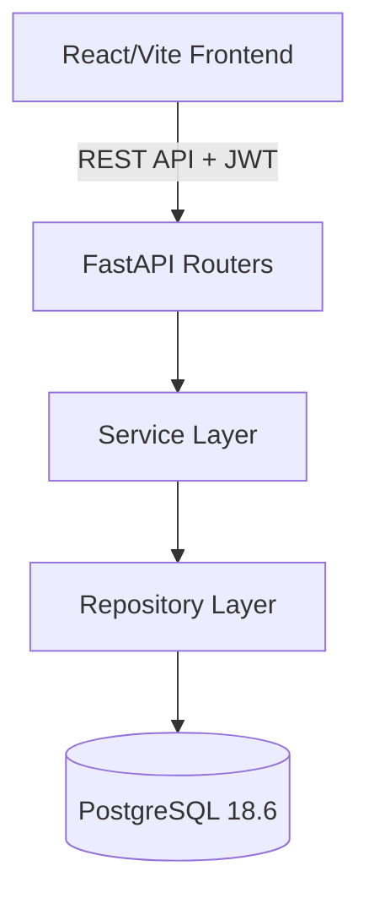

# System Architecture

PropQuery follows a rigorous **Clean Architecture** paradigm, ensuring a strict separation of concerns between the API layer, business logic, and database operations.

## High-Level Architecture

## Backend Structure

The backend (`/backend/app`) is designed for enterprise scalability:
1. **API Routers (`app/api/routes`)**: Handles HTTP requests, JWT validation, and Pydantic schema validation. No business logic lives here.
2. **Services (`app/services`)**: Contains core business logic (e.g., Support Ticket state transitions and audit logging).
3. **Repositories (`app/repositories`)**: Encapsulates all SQLAlchemy ORM operations and raw SQL executions.
4. **Models (`app/models`)**: Declarative SQLAlchemy definitions of the database tables.
5. **Schemas (`app/schemas`)**: Pydantic models for strict data validation (In/Out).

## Frontend Structure

The frontend (`/frontend`) is built using React 19 and Vite, following the "beige/cream" enterprise aesthetic.
1. **API Client (`src/api/client.js`)**: A centralized Axios instance with interceptors for automatically injecting the Bearer token.
2. **Components (`src/components/ui`)**: Highly reusable, data-dense components (`DataTable`, `Card`, `StatusBadge`, `Modal`).
3. **Context (`src/context/AuthContext.jsx`)**: Global state management for user sessions and JWT persistence.
