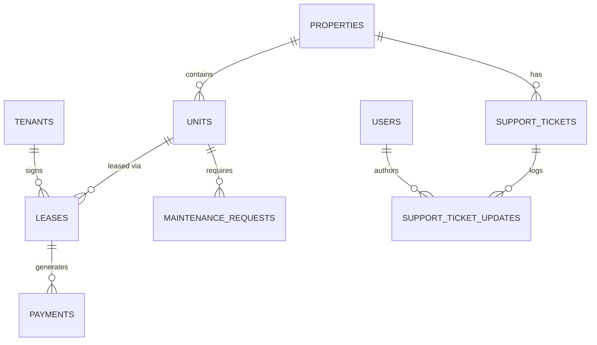

# Database Schema

PropQuery utilizes a highly normalized PostgreSQL 18.6 database schema mapped via SQLAlchemy 2.0.

## Entity-Relationship Overview

## Core Tables

- **Users**: Admin accounts used for JWT Authentication (`email`, `hashed_password`).
- **Properties**: Core real estate assets (`name`, `address`, `property_type`).
- **Units**: Individual rentable spaces linked to a Property (`unit_number`, `rent`, `status`).
- **Tenants**: Customers residing in units (`first_name`, `email`, `phone`).
- **Leases**: The binding agreement between a Tenant and a Unit (`start_date`, `end_date`, `rent_amount`).
- **Payments**: Transactions logged against specific leases (`amount`, `payment_date`, `status`).

## Application Support Tables
- **Support_Tickets**: Internal application tracking (`status: OPEN, INVESTIGATING, RESOLVED`).
- **Support_Ticket_Updates**: Immutable audit log of all changes made to a ticket, including manual engineer notes and automated state transition logs.
